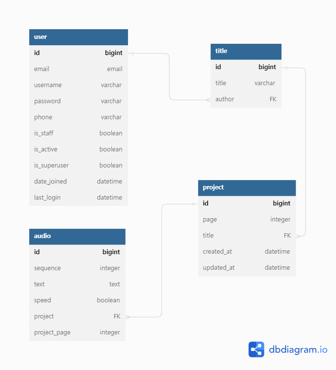
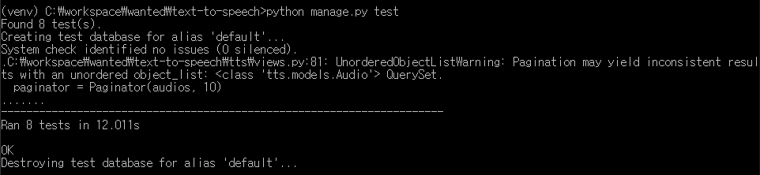

# :loudspeaker:text-to-speech
Text to Speech(TTS) 딥러닝 모델을 사용하기 위한 일부 기능 REST API 서비스

# :bookmark_tabs: 목차
* [개발 기간](#calendar-개발-기간)
* [프로젝트 개요](#books-프로젝트-개요)
    * [프로젝트 설명](#page_facing_up-프로젝트-설명)
    * [프로젝트 요구사항](#clipboard-프로젝트-요구사항)
    * [사용 기술](#hammer-사용-기술)
    * [모델링](#floppy_disk-모델링)
    * [API Test](#hourglass_flowing_sand-api-test)
    * [프로젝트 분석](#mag_right-프로젝트-분석)
* [API Endpoint](#pushpin-api-endpoint)
  * [User](#user)
  * [TTS](#tts)

# :calendar: 개발 기간
2022.11.03. ~ 2022.11.04.

# :books: 프로젝트 개요
## :page_facing_up: 프로젝트 설명
Text to Speech(TTS) 딥러님 모델을 사용한 프로젝트를 만들기 위한 테이블 설계, 구축하여 REST API 서버 개발

# :clipboard: 프로젝트 요구사항
1. Text to Speech(TTS) 딥러닝 모델을 사용하기 위한 일부 기능을 구현하는 과제입니다.
2. 프로젝트 생성(오디오 생성)
    * 텍스트(str)가 담긴 리스트를 받습니다. (length = 1)
    * 이를 전처리하여 오디오를 생성하는 함수의 input으로 같이 넣습니다.
      [['text1', 'text2', 'text3', ....], path]
    * 일정시간 이후 함수에서 (id, text)형태의 원소를 가진 리스트를 리턴합니다.
      [('id1' ,'text1'), ('id2', 'text2'), ('id3', 'text3'), ....]
    * 오디오는 input의 path에 저장됩니다
3. 텍스트 조회
    * 특정 프로젝트의 n번째 페이지를 조회합니다.
    * 한페이지는 10문장으로 이루어져 있습니다.
4. 텍스트 수정
    * 한 문장의 텍스트와 스피드를 수정합니다.
5. 오디오파일 송신
    * 요청받은 오디오파일을 송신합니다.
6. 텍스트(오디오) 생성 / 삭제
  	* 삽입위치는 항상 앞, 뒤가 아닌 중간도 가능.
7. 프로젝트 삭제

## :hammer: 사용 기술
* Back-End: Python, Django, Django REST Framework, Django REST Framework simplejwt
* Database: SQLite
* ETC: Git, Github, gtts

## :floppy_disk: 모델링

* `User(사용자)`, `Title(프로젝트 제목)`, `Project(프로젝트)`, `Audio(오디오)` 모델링
* `Project(프로젝트)`는 page 단위, `Audio(오디오)`는 문장단위

## :hourglass_flowing_sand: API Test
* 유저 관리: 회원가입, 로그인 등 테스트 코드 작성
* 프로제긑 생성, 텍스트 조회, 오디오 텍스트 수정 등 테스트 코드 작성

## :mag_right: 프로젝트 분석
* `users`, `tts` 2개의 앱으로 분리하여 관리
* JWT 토큰을 발금하여 인증 관리
* 프로젝트 제목과 텍스트를 입력받음
* 테스트의 전처리 과정이 끝나면 프로젝트 한 페이지당 10개의 오디오로 저장
* 하나의 오디오는 한 문장으로 구분
* tts로 생성된 오디오 파일은 페이지 단위로 생성

# :pushpin: API Endpoint
## User
|URL|Method|Action|Description|
|:---|:---:|:---:|:---|
|/api/v1/users/register/|POST|-|사용자 회원가입|
|/api/v1/users/login/|POST|-|사용자 로그인|
|/api/v1/users/logout/|POST|-|사용자 로그아웃|
|/api/v1/users/token/refresh/|POST|-|refresh 토큰을 통한 access 토큰 재발급|

## TTS
|URL|Method|Action|Description|
|:---|:---:|:---:|:---|
|/api/v1/tts/project/|POST|-|프로제그 생성|
|/api/v1/tts/project/{pk}/?query="텍스트"|GET|List|특정 텍스트 조회|
|/api/v1/tts/project/{pk}/|DELETE|Delete|프로젝트 삭제|
|/api/v1/tts/audio/{pk}/|PUT|Update|텍스트 수정|
|/api/v1/tts/audio/{pk}/|DELETE|Delete|오디오 삭제|
